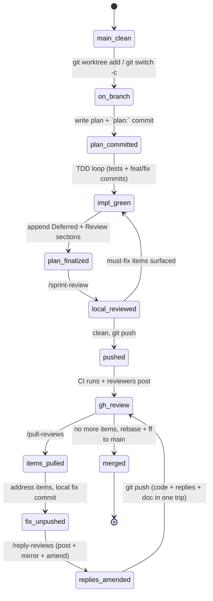

[](https://github.com/cmk/template-rust/actions/workflows/ci.yml)

# template-rust

A Rust workspace template wired for agent-assisted development. Pinned
toolchain, TDD workflow, a two-tier local + GitHub review loop, and an
optional poll-and-fix automation for review rounds. The spec for how
agents work in this repo lives in [CLAUDE.md](CLAUDE.md); this README
is the human-facing tour.

## What's in the box

- **Pinned toolchain** via `rust-toolchain.toml` (Rust 1.85 + clippy +
  rustfmt). CI installs the same channel via
  `dtolnay/rust-toolchain@1.85.0`.
- **Pre-commit hook** (`.claude/settings.json`) runs `cargo fmt --check`
  (warn-only), a PII scan, `cargo test`, and `cargo clippy`. Blocks on
  any real failure; `fmt` drift is a nag, not a blocker.
- **CI jobs**: `test` (test + clippy + fmt warn), `deny` (cargo-deny
  licenses/advisories/sources), `secrets` (gitleaks on full history).
- **Two-tier review**: `/sprint-review` runs an independent reviewer
  agent locally before push; Claude Code Action and/or Copilot pick it
  up on the PR after push. Findings from both rounds land in one
  `doc/reviews/review-NNNNN.md` file per PR.
- **Finalize-a-round slash command**: `/reply-reviews` posts replies,
  mirrors them into the review doc, and folds the doc into the
  unpushed fix commit — one push delivers code + replies + audit
  trail. Refuses to run if the fix commit is already pushed.
- **Automated poll loop**: `/loop /watch-pr <N>` watches a PR for
  new reviewer activity, auto-fixes items whose intent is
  unambiguous (one file, <20 lines, no API removal), runs the
  `/reply-reviews` flow, and **stops before push**. Dynamic-mode
  backoff: 5/5/5/10/10 min, auto-quit on the 6th quiet tick.
- **PR-number prediction** (`scripts/next_pr_number.sh`): review
  files are named `review-NNNNN.md` from the start, before the PR is
  opened.

## Review round lifecycle



`fix_unpushed` is the load-bearing state — `/reply-reviews` only runs
there, so the reply mirror never ends up stranded in the working tree.
The `/watch-pr` loop has its own state diagram; both live in
[doc/workflow.md](doc/workflow.md).

## Layout

```
Cargo.toml              — workspace root
rust-toolchain.toml     — pinned Rust channel
rustfmt.toml            — edition 2024
deny.toml               — cargo-deny policy
.editorconfig
crates/
  core/                 — shared types, test utilities, proptest strategies
  cli/                  — binary entrypoint; feature-gates optional lib crates
doc/
  plans/                — sprint plans (plan-YYYY-MM-DD-NN.md)
  reviews/              — one file per PR, local + GitHub rounds combined
  workflow.md           — state diagrams
scripts/
  check-pii.sh          — grep staged diff for /Users/, /home/, keys, tokens
  next_pr_number.sh     — predicts the next PR number via gh api
  pull_reviews.py       — fetches PR comments into review-NNNNN.md
  reply_review.py       — posts a reply to a review thread
  autosquash.sh         — collapses --fixup commits before push
.claude/
  commands/             — slash commands (/sprint-review, /watch-pr, …)
  settings.json         — pre-commit hook
  settings.local.json   — per-user permission allow/deny list
```

## Using this template

1. Clone or fork, then:
   - Rename crates (`project-core`, `project-cli`) and update workspace
     `name`/`description` in each `Cargo.toml`.
   - Set `.github/CODEOWNERS` to your GitHub handle (currently `@cmk`).
   - Clear `doc/reviews/` of everything except `review-00000.md`
     (the protected sentinel; see its contents for why).
2. Read [CLAUDE.md](CLAUDE.md) top-to-bottom once — it's the source of
   truth for the TDD + review workflow. This README is a derived view.
3. Start a sprint: pick a plan number, ask worktree-or-branch, write
   the plan, commit as `plan: <goal>`. The workflow takes over from
   there.

## License

MIT.
