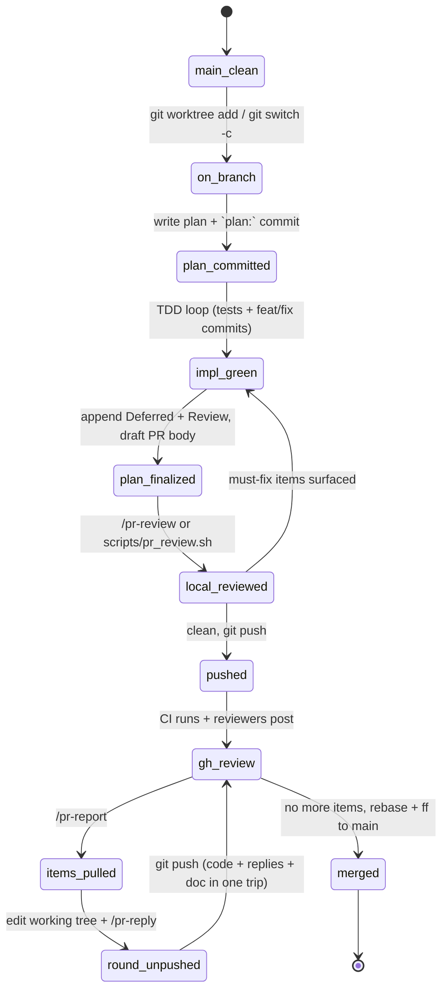

[](https://github.com/cmk/template-rust/actions/workflows/ci.yml)

# template-rust

A Rust workspace template wired for agent-assisted development. Pinned
toolchain, TDD workflow, a two-tier local + GitHub review loop, and an
optional poll-and-fix automation for review rounds. The spec for how
agents work in this repo lives in [AGENTS.md](AGENTS.md); this README
is the human-facing tour.

## What's in the box

- **Pinned toolchain** via `rust-toolchain.toml` (Rust 1.88 + clippy +
  rustfmt). CI installs the same channel via
  `dtolnay/rust-toolchain@1.88.0`.
- **Two-layer local hook chain**: a Claude Code `PreToolUse` hook
  (`.claude/settings.json`) gates agent-invoked `git commit*` Bash
  calls, plus git-side `pre-commit` and `pre-push` hooks. Commit-time
  checks run `cargo fmt --check`, the PII scan, and the layer check;
  push-time checks run `cargo test --workspace` and clippy. Activate
  the git-side layer on a fresh clone:
  `git config core.hooksPath .githooks`.
- **CI jobs**: `test` (test + clippy + fmt warn), `deny` (cargo-deny
  licenses/advisories/sources), `secrets` (gitleaks on full history).
- **Two-tier review**: `/pr-review` for Claude Code or
  `scripts/pr_review.sh` for Codex runs an independent local review
  before push; Claude Code Action and/or Copilot pick it up on the PR
  after push. Findings from both rounds land in one
  `doc/reviews/review-NNNNN.md` file per PR.
- **Finalize-a-round slash command**: `/pr-reply` posts replies,
  mirrors them into the review doc, and folds the doc into the
  unpushed fix commit — one push delivers code + replies + audit
  trail. Refuses to run if the fix commit is already pushed.
- **Automated poll loop**: `/loop /pr-watch <N>` watches a PR for
  new reviewer activity, auto-fixes items whose intent is
  unambiguous (one file, <20 lines, no API removal), runs the
  `/pr-reply` flow, and pushes the round commit. Dynamic-mode
  backoff: 5/5/5/10/10 min, auto-quit on the 6th quiet tick.
- **PR-number prediction** (`scripts/pr_request.sh`): review
  files are named `review-NNNNN.md` from the start, before the PR is
  opened.

## Review round lifecycle


```mermaid
stateDiagram-v2
    [*] --> main_clean
    main_clean --> on_branch: git worktree add / git switch -c
    on_branch --> plan_committed: write plan + `plan:` commit
    plan_committed --> impl_green: TDD loop (tests + feat/fix commits)
    impl_green --> plan_finalized: append Deferred + Review, draft PR body
    plan_finalized --> local_reviewed: /pr-review or scripts/pr_review.sh
    local_reviewed --> impl_green: must-fix items surfaced
    local_reviewed --> pushed: clean, git push
    pushed --> gh_review: CI runs + reviewers post
    gh_review --> items_pulled: /pr-report
    items_pulled --> round_unpushed: edit working tree + /pr-reply
    round_unpushed --> gh_review: git push (code + replies + doc in one trip)
    gh_review --> merged: no more items, rebase + ff to main
    merged --> [*]
```

`round_unpushed` is the load-bearing state — one atomic commit contains
both the code fix and the mirrored reply doc, and it must be pushed
before merge.

Two reasons for this ordering:

1. **One CI run per round.** Bundling the fix, replies, and mirror into
   one commit means they ride a single push. The alternative — separate
   commits for code and mirror — doubles the CI load per round.
2. **Replies and code stay atomic.** Replies are posted only after the
   fix edits exist locally, then the mirrored review doc and code land
   in one commit. That keeps the GitHub thread and branch history from
   drifting apart.

The `/pr-watch` loop has its own state diagram; both live in
[doc/workflow.md](doc/workflow.md).

## Layout

```
Cargo.toml              — workspace root
AGENTS.md               — canonical agent workflow and repo instructions
CLAUDE.md               — compatibility symlink to AGENTS.md
rust-toolchain.toml     — pinned Rust channel
rustfmt.toml            — edition 2024
deny.toml               — cargo-deny policy
.editorconfig
crates/
  core/                 — shared types, test utilities, proptest strategies
  cli/                  — binary entrypoint; feature-gates optional lib crates
doc/
  plans/                — sprint plans (plan-YYYY-MM-DD-NN.md)
  reviews/              — one file per PR, local + GitHub rounds combined
  workflow.md           — state diagrams
scripts/
  check_pii.sh          — grep staged diff or --tree ref for PII/secrets
  pr_request.sh         — predicts the next PR number via gh api
  pr_report.py          — paths, PR bodies, and GitHub review mirroring
  pr_reply.py           — posts a reply to a review thread
  workflow_state.sh     — reports the inferred workflow FSM state
  pr_review.sh          — Codex local-review transition
  git_squash.sh         — collapses --fixup commits before push
  git_merge.sh          — guarded gh pr merge wrapper
.claude/
  commands/             — Claude Code slash commands (/pr-review, /pr-watch, ...)
  settings.json         — pre-commit hook
  settings.local.json   — per-user permission allow/deny list
```

## Using this template

1. Clone or fork, then:
   - Rename crates (`project-core`, `project-cli`) and update workspace
     `name`/`description` in each `Cargo.toml`.
   - Set `.github/CODEOWNERS` to your GitHub handle (currently `@cmk`).
   - Clear `doc/reviews/` of everything except `review-00000.md`
     (the protected sentinel; see its contents for why).
   - Activate the git-side pre-commit hook:
     `git config core.hooksPath .githooks`. (Layer 1 in
     `.claude/settings.json` works without any setup; this enables
     Layer 2, the unbypassable safety net at commit time.)
2. Read [AGENTS.md](AGENTS.md) top-to-bottom once — it's the source of
   truth for the TDD + review workflow. This README is a derived view.
3. Start a sprint: pick a plan number, ask worktree-or-branch, write
   the plan, commit as `plan: <goal>`. The workflow takes over from
   there.

## License

MIT.
