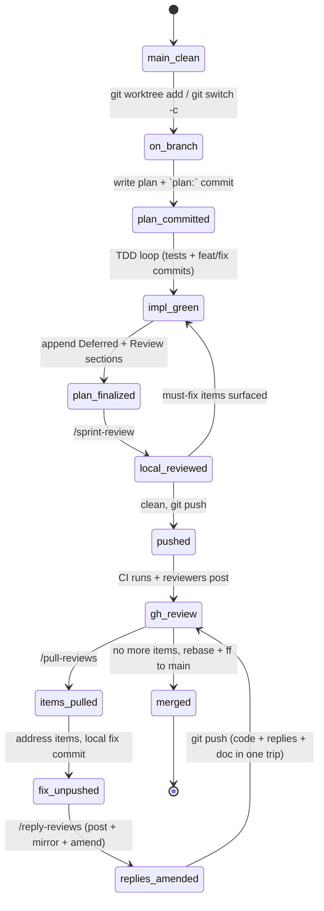
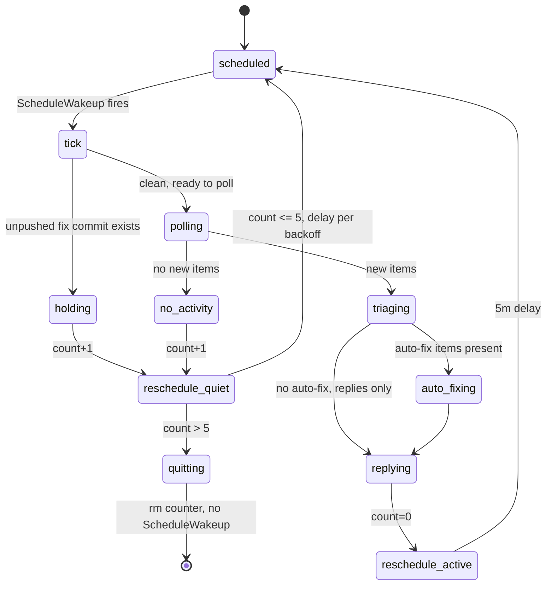

# Workflow State Diagrams

Visual reference for the review-round and `/watch-pr` workflows defined
in `../CLAUDE.md`. The prose specs there are authoritative; these
diagrams exist to make the state transitions easier to eyeball when
debugging an unexpected situation — a stuck fix commit, a loop that
won't quit, an ordering question about when to run which command.

GitHub renders mermaid in markdown natively, so both diagrams below
show up as real graphs on the PR page.

## Review round lifecycle

One sprint from `main` through merge, covering Tier 1 (local) review,
Tier 2 (GitHub) rounds, and the fix → reply → mirror → amend → push
motion that `/reply-reviews` enforces.

**Legend:**
- `fix_unpushed` is the load-bearing state. `/reply-reviews` refuses
  to run outside it, so the reply mirror never ends up stranded in the
  working tree.
- The `gh_review → items_pulled → fix_unpushed → replies_amended → gh_review`
  cycle runs once per review round. Pushing before the amend breaks
  the cycle — it forces either a wasted `doc:` commit (extra CI
  round-trip) or a disallowed force-push.
- `local_reviewed → impl_green` is the must-fix loop-back. The fix
  commits stay on the same branch; re-append any new Deferred/Review
  notes, then `/sprint-review` re-runs against the new tip.
- `plan_finalized` sits deliberately *before* `local_reviewed`: the
  reviewer reads the plan as context and should see its final form,
  including what was intentionally cut and why.

## `/watch-pr` dynamic-mode loop

The `/loop /watch-pr <N>` self-pacing loop, with its 5/5/5/10/10-minute
backoff and auto-quit on the 6th consecutive quiet tick (after the
5-slot backoff is exhausted). Counter state lives in
`.watch-pr/pr-<N>.count` (gitignored).

**Legend:**
- `holding` is not a failure — it's the safety valve that keeps the
  loop from stepping on a fix commit you haven't reviewed and pushed.
  It still counts as a quiet tick.
- `reschedule_quiet` reads the backoff table: count 1→5m, 2→5m, 3→5m,
  4→10m, 5→10m, >5 → quit (total silence budget ≈ 35 minutes).
- Any `reschedule_active` edge resets the counter to 0, so a burst of
  review activity mid-backoff restores the 5-minute cadence.
- `quitting` terminates the dynamic loop: the state file is removed
  and `ScheduleWakeup` is deliberately *not* called. A fixed-interval
  loop (`/loop 5m /watch-pr <N>`) has no backoff and no quit — it
  runs until the user kills it.

## When a diagram disagrees with CLAUDE.md

CLAUDE.md wins. These are derived views; re-draw them when the
workflow prose changes. A lagging diagram is worse than no diagram.
